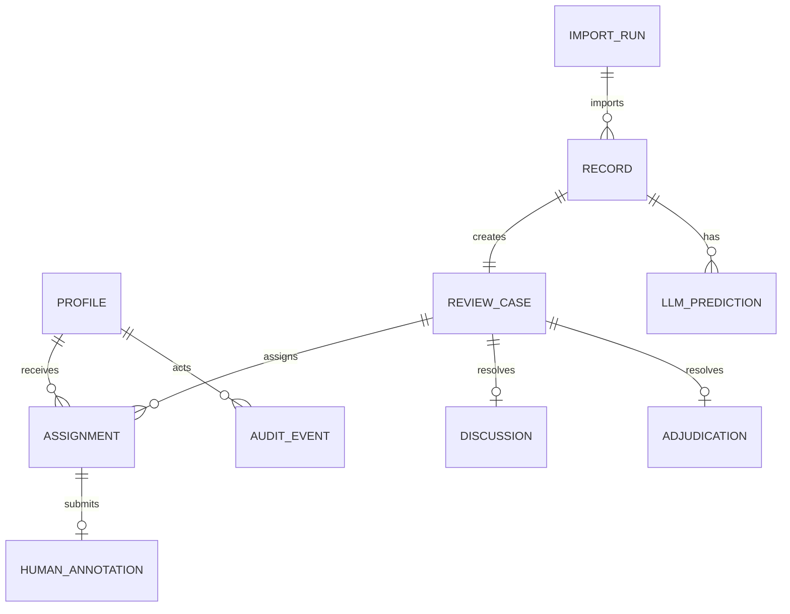

# Data Dictionary and Preliminary ERD

## ERD sơ bộ

## Các entity bắt buộc

| Entity | Khóa/field chính | Ràng buộc quan trọng |
|---|---|---|
| Profile | annotator_code, role, is_active | code unique; REVIEWER/ADMIN |
| ImportRun | import_run_id, source_run_id, hashes | source/hash idempotent |
| Record | record_id, text_annotation, data_role | record_id immutable; không raw metadata |
| LLMPrediction | record_id, model_slot, run_id | unique tuple; có thể không tồn tại ở test reserve |
| ReviewCase | case_id, route, status, required_reviews | 1 visible hoặc 2 blind |
| Assignment | assignment_id, case_id, reviewer, slot, row_version | unique case+slot và case+reviewer |
| HumanAnnotation | assignment_id, labels, action, save_status | một initial active row; submitted immutable |
| Discussion | case_id, proposal, proposer, confirmations | chỉ sau 2 submitted khác nhau |
| Adjudication | case_id, labels, admin, rationale | chỉ ở ADJUDICATION_REQUIRED |
| AuditEvent | event_id/order, actor, event_type, time | append-only |

Field export phải theo `docs/reference/02_DATA_CONTRACT(1).md`; internal names được mapping nhưng không được đổi contract im lặng.

