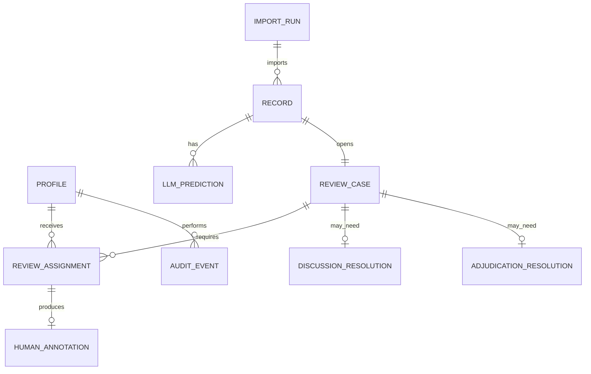

# Preliminary ERD

Reference constraints for Ngọc's database implementation:

- unique `(record_id, import_run_id)` active case;
- unique `(record_id, model_slot, run_id)` prediction;
- unique `(case_id, review_slot)` and `(case_id, reviewer_id)`;
- one active initial annotation per assignment;
- one reviewer cannot fill both slots;
- single-visible requires one visible assignment;
- double routes require two different blind reviewers;
- submitted initial rows must remain immutable/versioned.
